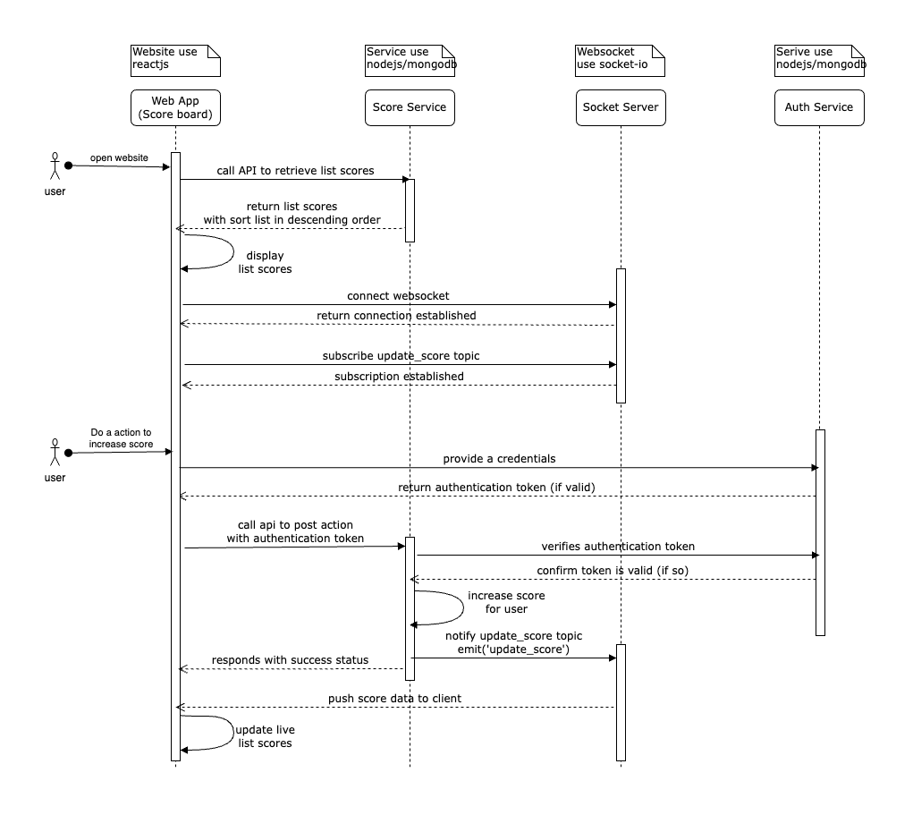

## Design Goals

- The website (Score board) should show the top 10 user’s scores.
- Users can do an action to increase the user’s score.
- Use the web socket for a real-time update of the score board.
- Authentication service to prevent malicious users from increasing scores without authorization.

## Proposed Solution

### Tech Stack

- **Website(Frontend, score board):** ReactJS
- **Score Service**: NestJS framework and MongoDB(Mongoose)
- **Socket Server**: Use Socket.io for real-time update score on board.
- **Auth Service**: NestJS framework, MongoDB(Mongoose) and JWT authentication (with basic username/password login)

### Sequence Diagram



### API construction

#### Score Service

1.  Get list scores:

    - Path: `/scores`
    - Method: `GET`
    - Params query:

      `limit: 10`

    - Response body:

      ```
      [
          {
              "id": "d93ab302-743a-4097-8889-520922274d5b",
              "name": "test_a",
              "score": 6
          },
          {
              "id": "14021945-dc45-4710-86df-c3dbb5d5163c",
              "name": "test_b",
              "score": 5
          }
      ]
      ```

    ```
    curl --location 'http://localhost:3000/v1/scores?limit=10'
    ```

2.  Post action(To increase score):

    - Path: `/scores`
    - Method: `POST`
    - Request body:
    - Response body:

      ```
      {
          "id": "d93ab302-743a-4097-8889-520922274d5b",
          "name": "test_a",
          "score": 6
      }
      ```

    ```
    curl --location 'http://localhost:3000/v1/scores \
    --header 'Content-Type: application/json' \
    --data '{
      "action": "increase"
    }'
    ```

#### Socket Service

1.  Setup socket connection with `socket-io` library.
2.  Setup `update_score` topic.

#### Auth Service

1.  Post login API with basic credentials.

    - Path: `/auth/login`
    - Method: `POST`
    - Request body:

      ```
      {
        "username": string,
        "password": string
      }
      ```

    - Response body:

      ```
      {
        "accessToken": string
      }
      ```

    ```
    curl --location 'http://localhost:3000/v1/auth/login' \
    --header 'Content-Type: application/json' \
    --data '{
      "username": "john",
      "password": "john123"
    }'
    ```

2.  Verify token API (Internal API)

    - Path: `/auth/login`
    - Method: `POST`
    - Request body:

      ```
      {
        "token": string
      }
      ```

    - Response body:

      ```
      {
        "valid": true/false
      }
      ```
